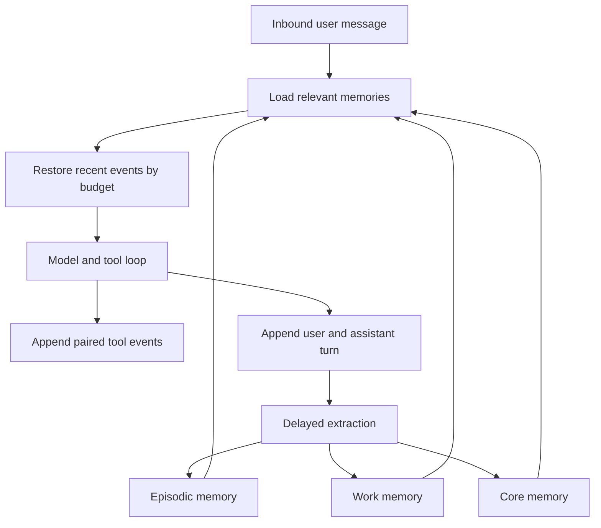
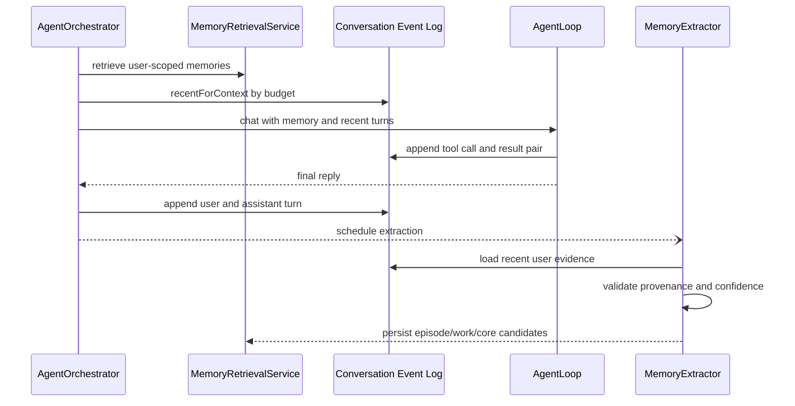

# Memory Module Analysis

## Executive Summary

| Field | Value |
|---|---|
| Module | `src/main/java/com/liche/wechatagent/memory` with orchestration in `agent` |
| Purpose | Preserve a user's conversation continuity, meaningful experiences, stable facts, active goals, and historical evidence |
| System Role | User-scoped memory pipeline between inbound messages and model-context assembly |
| Criticality | High — incorrect scoping can leak data and poor retrieval directly degrades companion continuity |
| Technology | Java 21, Spring Boot, Spring Data JPA, MySQL, Redis fallback, LangChain4j |

## Technical Analysis

### Responsibilities

- Persist user and assistant messages plus paired tool-call/tool-result events as the durable event source.
- Rebuild recent conversational context from persistent events under a configurable character budget.
- Extract meaningful experiences into episodic memory with time, status, confidence, keywords, and provenance.
- Maintain active work memory, stable core memory, superseded versions, archives, and change logs.
- Retrieve only current-user records and rank core, work, episodic, archive, and conversation evidence.
- Remove source evidence when a user explicitly forgets a memory and include durable state in local backups.

### Key Classes

| Name | Type | Purpose |
|---|---|---|
| `ConversationMemoryService` | Service | Appends durable events, retrieves history, and builds recent context by budget |
| `EpisodicMemoryService` | Service | Creates, deduplicates, updates, retrieves, touches, and forgets meaningful experiences |
| `MemoryExtractor` | Component | Converts recent user statements into episodic, work, core, update, conflict, and completion candidates |
| `MemoryRetrievalService` | Component | Ranks and renders relevant active and historical memories with final ownership checks |
| `MemoryLoader` | Component | Supplies bounded memory sections to the agent loop |
| `AgentOrchestrator` | Component | Loads durable recent history and persists completed user/assistant turns |
| `AgentLoop` | Component | Executes model/tool rounds and writes paired tool events to the durable log |
| `MemoryBackupJob` | Scheduled component | Backs up memory, event evidence, reminders, and media by user |

### Primary Execution Flow

1. `AgentOrchestrator` receives a message inside a per-user serial executor.
2. `MemoryLoader` retrieves relevant core, work, episodic, archived, and older conversation evidence.
3. Recent user/assistant turns are rebuilt from `conversation_memory` under turn and character limits; Redis is the fallback.
4. `AgentLoop` invokes the model and records each tool call/result pair under the current `userId`.
5. The final user/assistant turn is appended to Redis and the persistent event log.
6. `MemoryExtractionScheduler` runs `MemoryExtractor` after the quiet window.
7. Extracted memories retain source message IDs and any associated stored-media IDs.

### State and Error Handling

- Every database lookup is scoped by `userId`; retrieval performs a second ownership check before rendering.
- Extraction results are written only if the quiet-window generation remains current and while holding a per-user mutation lock.
- Conversation persistence is best-effort and logs failures without failing the user reply.
- Invalid, low-confidence, oversized, or unsupported extraction candidates are discarded.
- Production schema validation requires the supplied episodic-memory migration before deploying the new JAR.

## Module Communication

| Direction | Component | Type | Description |
|---|---|---|---|
| Consumes | `AgentOrchestrator` | Synchronous call | Requests relevant memory and recent context for one user |
| Consumes | `AgentLoop` | Synchronous call | Appends tool events during a model round |
| Consumes | `MemoryExtractionScheduler` | Asynchronous executor | Starts delayed extraction after conversation becomes quiet |
| Exposes | MySQL repositories | Persistent state | Stores event, episodic, work, core, archive, and provenance records |
| Exposes | `MemoryLoader` | Synchronous return | Returns bounded core and work/episode/history prompt sections |
| Shared state | Redis | Cache/fallback | Keeps immediate turns when durable retrieval is unavailable |

## Technical Diagrams

The flow below shows how durable events now drive both immediate continuity and slower long-term memory formation.

## Metrics

| Metric | Before | After | Delta | Status |
|---|---:|---:|---:|---|
| Durable memory layers | 3 | 4 | +1 episodic layer | DONE |
| Recent persistent-context policy | Fixed extraction/history windows | 40-turn and 12,000-character budget | Dynamic budget added | DONE |
| Durable event types | User, assistant | User, assistant, paired tool call/result | +2 event phases | DONE |
| Ownership validation points for episodes | 0 | 2 | Service and final retrieval checks | DONE |
| Focused regression tests added | 0 | 6 | Context, episode lifecycle, retrieval isolation, backup cleanup | DONE |

## Referencias

- [[REFACTOR]] — Completed refactor scope and remaining optional evolution
