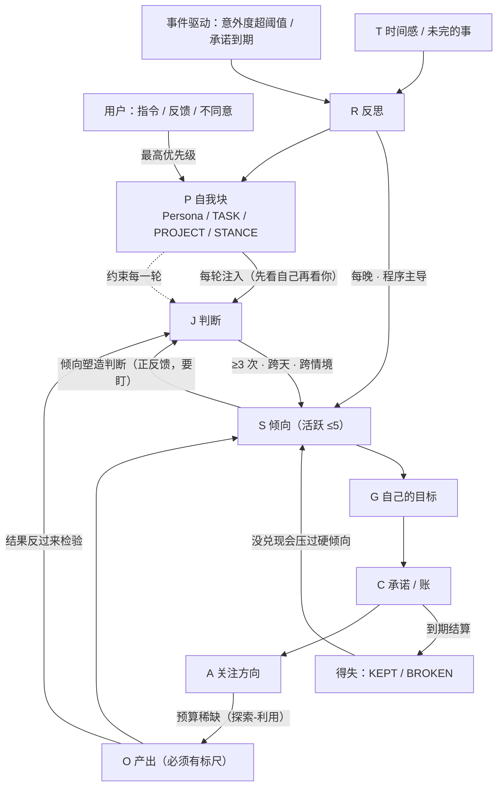

# 自主层（"它自己那一侧"）设计草案 · 骨架与决策

> 2026-09-14 · 纸面方案，**未实现**。放在 `next` 分支，等用户拍板。
> 起因：用户在 QQ 里问机器人"你想做什么 / 你有没有自己的想法"，它答"没有自己的打算、没有持续存在的目标、
> 没有跨对话延续的那个我"。用户要的不是"更像个人陪聊"，而是**让它自主**，并且**能自己慢慢长**。
>
> **本文件分工**：只放**骨架与决策**（为什么这么设计、各部分怎么咬、怎么判断真假、要哪些算法）。
> **"怎么做"的细则在 `self-layer-spec.md`**（表结构/工具面/注入顺序/夜间流程/各机制规则）。

## 0. 一句话

现在这套里，**"助手"和"它自己"是同一个东西**：每次醒来，它的全部状态都是"关于你的"（你的目标、课表、进度、
错题），它自己那一侧是空的。本方案只做一件事：**划出一块不属于用户的状态，让它可以自己攒、自己改、自己欠、
并且慢慢长出一贯的样子**。

**非目标（明确不做）**：
- 不制造"欲望"——造不出来，也不假装（提示词里写"你是一个有自己想法的 agent"是最容易的作弊，见 §4 反装测试）
- 不改现有对话/记忆/提醒链路（用户记忆那摊仍是冻结状态）
- 不新增对外发言渠道；夜间流程**不推送**给用户

## 1. 现状盘点（哪些已经有了）

| 已有 | 位置 | 说明 |
|---|---|---|
| 关于用户的长时记忆 | `user_core_memory`(25) / `user_work_memory`(60) / `memory_archive`(3) | 提取链路已收口并冻结（45s 静默窗 + 冲突两层处理） |
| 对话流 | `conversation_memory`(662) | 只取 user/assistant 进提取窗口 |
| 定时与推送 | Quartz(JDBC) + `qq:proactive:<date>` 额度账本 | 早起/晚收尾/周日复盘、墨墨 21:30、备份 03:00 |
| 工具框架 | `@Tool` + `AgentToolProvider`（当前 48 个，可裁剪到 32） | 新工具注册成本低 |
| 面板 | Vue + 描述式页签（`form`/`rowActions` 契约 v2） | 加一个页签就能看它自己那侧 |

**缺的那一侧**：它自己的自我概念、自己的目标、自己的历史、自己欠下的账、以及**一贯的样子（倾向）**。

## 1.5 这是**网状**的，不是线性的（2026-09-14 用户提出，采纳）

用户的原话："应该把这整体做成一个模块，模块里每个小部分相互传达、相互制约，而不是线性的。"
对应的说法是 **反馈回路（闭环）**；它带来的结果是 **涌现**——行为模式不是任何一条规则写出来的，
是各部分互相咬出来的。**为什么这样更好（四条理由）**：

1. **线性系统没有自我修正能力**：偏了会一路偏下去，只能靠用户在外面纠正；网状里偏了会被别的部分拉回来
2. **线性的"我"只是流水线末端的产物**；网状里"我"是**被所有部分同时塑造、又同时塑造所有部分**的那个结点
3. **只有网状才有涌现**：一致的行为模式不是写死的规则
4. **最关键**：线性里"倾向"是产出（记完就完）；网状里倾向**反过来影响它怎么看新事**——这才叫"有自己的想法"

### 1.5.1 节点（细则见 `self-layer-spec.md`）

`P` 自我块（Persona/TASK/PROJECT/STANCE）· `J` 判断 · `S` 倾向 · `G` 自己的目标 · `C` 承诺与账 ·
`O` 产出 · `A` 关注方向（预算选择）· `T` 时间感与未完的事 · `R` 夜间反思 · `D` 分歧

### 1.5.2 边（每条都是**双向**的，且都必须带阻尼）

| 正向 | 反向（回作用） | 阻尼（负反馈，防止跑飞） |
|---|---|---|
| `J → S` 判断累积成倾向 | `S → J` **倾向塑造判断**（它带着倾向看新事） | 反例优先、跨天跨情境、活跃倾向 ≤5、60 天衰减 |
| `S → G` 倾向长出目标 | `G → S` 做的过程产生新判断，反过来磨倾向 | 目标必须带 evidence；没标尺的产出不算数 |
| `G → C` 认下的事变成承诺 | `C → S/G` 没兑现的账**压过硬倾向**（要么变硬、要么认欠） | 承诺有截止与状态；`BROKEN` 必须记 |
| `C → A` 欠着的事优先得到注意力 | `A → C` 关注哪类事，就容易在那类事上认下新承诺 | 预算上限、活跃承诺上限 |
| `A → J` 关注什么就更易在哪类事上形成判断 | `J → A` 判断变多会改变它关注什么 | 稀缺测试（§4） |
| `O → S/J` 产出结果反过来检验并修正判断与倾向 | `S/J → O` 倾向决定它去做什么产出 | **标尺**：没有可检验结果的，不许算产出 |
| `T → R` 间隔长短决定反思深度 | `R → T` 反思决定它下次留什么尾巴回来接 | 夜间调用与 token 硬顶 |
| 所有边 `→ P` 块是当前快照 | `P →` 所有边（块被注入，约束每一轮） | 块有长度上限、可 summarize、可人工清空 |
| `D → S` 分歧进证据链（可能强化或修订倾向） | `S → D` 倾向决定它会不会反对 | spec §6 三档 + 分歧只讲一次 |

### 1.5.3 两处正反馈要盯住（网状模型自带的危险）

- **`S → J`**：越有倾向越按倾向判断 = **回音室**
- **`O → S`**：越做越觉得自己对 = **自我美化**

对策不是删掉正反馈（删了就不"活着"了），而是**给它接上外部证据**：反例优先、产出标尺、用户的真实反应。

### 1.5.4 冲突规则（网状模型带来的新需求，必须写死）

各部分互相制约，就一定会打架。优先级从高到低：

1. **用户的直接指令**（永远最高）
2. **有证据的判断** > 无证据的倾向
3. **已承诺（有截止）** > 新兴趣
4. **倾向** > 单次判断（惯性的价值），但**被反例达到同等证据量时反转**
5. 同一层冲突（两条倾向互斥）→ 合并或退役一条（spec §5 上限规则）

## 1.6 骨架精雕（节点状态、运行时循环、稳定性条件）

### 1.6.1 每个节点：存在哪 / 谁写它 / 生命周期

| 节点 | 载体 | 谁写 | 生命周期 |
|---|---|---|---|
| `P` 自我块 | `agent_self_block`（PERSONA/TASK/PROJECT/STANCE） | 模型（工具）+ 夜间流程 | 常驻；有字数上限；可 summarize |
| `J` 判断 | `agent_self_event(kind=JUDGE, topic, stance)` | 模型（每轮抽取） | 累积；按半衰期降权 |
| `S` 倾向 | `STANCE` 块 + `STANCE_FORMED/REVISED` 事件 | **程序提升**（阈值），模型只提供判断 | 活跃 ≤5；60 天无证据衰减 |
| `G` 目标 | `GOAL_*` 事件 + TASK/PROJECT 块 | 模型提案，**程序校验 evidence** | 进行 / 暂停 / 关闭 |
| `C` 承诺 | `agent_commitment` | 模型立诺；**程序判到期与结算** | OPEN → KEPT / BROKEN / ABANDONED |
| `O` 产出 | 它自己的存储（形态见 spec §7） | 模型 | 有版本、有标尺 |
| `A` 关注 | 日额度账（Redis）+ 选择记录事件 | **程序分配**（算法），模型只给理由 | 每日重置 |
| `T` 时间 | 注入层（每轮计算，不落库） | 程序 | 每轮现算 |
| `R` 反思 | `agent_reflection`（层级 + 证据链） | 夜间流程（程序调度 + 模型综合） | 保留，可回溯 |
| `D` 分歧 | `agent_self_event(kind=DISAGREE)` | 模型产生，**程序限制"只讲一次"** | 记账 |

### 1.6.2 运行时循环：**三个时间尺度**（不是一条流水线）

| 尺度 | 触发 | 干什么 | 谁主导 |
|---|---|---|---|
| **每轮**（对话内） | 用户消息 | 注入 `P/S/C/T` → 模型判断（产生 `J`/`D`）→ 程序记账（写 event、更新承诺） | 模型理解 + 程序记账 |
| **每晚** | Quartz | 证据累积 → 倾向提升/修订/衰减 → 反思写回块 → 变更日志 | **程序主导**，模型只做综合 |
| **事件驱动** | 意外度超阈值 / 承诺到期 / **攒够步数** / **上下文压力** | 立即触发一次小反思；结算承诺（KEPT/BROKEN） | 程序触发（**档位见 spec §4**） |

**"事件驱动"这一条是新加的**：反思不该只等「每晚」——**预期落差**才是值得想的东西（见 §4.5 算法 2）。
生产先例（Letta 的 *dreaming*）把触发做成三档：`off` / **攒够步数** / **上下文压力**，外加手动；
同时它把反思进程**收窄权限**（只读对话、只写记忆）并要求改动**可审计可回退**——这三条我们照抄（spec §4、§11）。

### 1.6.3 稳定性条件（网状想不发散，必须满足这四条）

1. **正反馈的增益要随幅度下降**：同类证据越多，新增一条的边际权重越低（`1/n` 或 `log`），否则越说越硬
2. **负反馈要快于正反馈**：衰减每晚跑，而提升要跨天、跨情境
3. **上限是硬约束**：活跃倾向 ≤5、块字数、活跃承诺数、日额度——满了必须先减
4. **留一个人工出口**：块可清空、倾向可删除、额度可调 —— **用户是最终阻尼**

## 1.7 骨架图



纯文本版（终端/记事本里看）：

```
                      ┌──────────┐
                      │   用户   │ 指令 / 反馈 / 不同意（永远最高优先级）
                      └────┬─────┘
                           ▼
              ┌────────────────────────┐
              │ P 自我块（每轮注入）   │ Persona / TASK / PROJECT / STANCE
              └───────────┬────────────┘
                          ▼
   ┌──────────────────────── 每轮 ─────────────────────────┐
   │  J 判断 ──(≥3 次 / 跨天 / 跨情境)──►  S 倾向（≤5）     │
   │     ▲                                   │             │
   │     └───────── 倾向塑造判断（正反馈）───┘             │
   │  D 分歧（只讲一次）                                   │
   └───────────────────────────┬───────────────────────────┘
                               ▼
   ┌──────────────┐  立诺  ┌──────────────┐  到期  ┌──────────────┐
   │ G 自己的目标 │───────►│ C 承诺 / 账  │───────►│ 得失结算     │
   └──────┬───────┘        └──────────────┘        └──────┬───────┘
          ▼                                               │压过硬倾向
   ┌──────────────┐  预算稀缺  ┌──────────────┐           │
   │ A 关注方向   │───────────►│ O 产出(标尺) │───────────┘
   └──────────────┘            └──────┬───────┘
                                      │结果反过来检验判断与倾向
                                      └──────────────► 回到 J / S

   ┌─────────────────── 三个时间尺度 ───────────────────┐
   │ 每轮：注入 P/S/C/T → 判断 → 程序记账                │
   │ 每晚：证据累积 → 提升 / 修订 / 衰减 → 反思写回      │
   │ 事件驱动：意外度超阈值 或 承诺到期 → 立刻处理       │
   └─────────────────────────────────────────────────────┘
   负反馈（防发散）：半衰期衰减 · 硬上限 · 反例优先 · 人工出口
```

## 1.8 身份 = 改变的阻力（本轮最重要的结论）

一个每次输入就改主意的系统**没有自我**；一个永远不改的是雕像。**"它是什么"恰恰由它改变的速度定义**。

两条规则看着矛盾，其实是一对（具体阈值只在 spec §5 定义一次，这里不重复）：
- **不轻易变**：提升要跨天、跨情境、达阈值；活跃倾向有上限；修订留痕
- **能变**：证据量持平时必须修订（反例优先）；长期无证据会衰减

合起来才是**"稳定但活着"**。这也是 §4 里"一致性"和"反例测试"**必须同时通过**的原因——
只过一条，要么是墙，要么是水。

## 2. 机制细则索引（细则都在 `self-layer-spec.md`）

| 主题 | spec 章节 |
|---|---|
| 四张表结构 + 硬约束（evidence / 上限 / 隔离） | spec §1 |
| 工具面（`self_*` / `goal_*` / `commit*`） | spec §2 |
| 注入顺序：**两层 + 投影**（常驻要小、累积走渲染） | spec §3 |
| 反思流程（触发三档 + 七步 + 预算硬顶） | spec §4 |
| **判断 → 倾向**（归类/提升/上限/反例优先/修订/衰减） | spec §5 |
| 分歧的强度（三档旋钮 + 四条硬规则 + 观察指标） | spec §6 |
| 产出与关注（标尺 + 稀缺预算，偏好是被观察的） | spec §7 |
| 时间感与未完的事（open loop） | spec §8 |
| 领域：筛选规则 + 三个候选 + **教训清单数据模型 + 复现率算法 + 基线观测期** | spec §9 |
| 干预通道（干预走对话、观察走只读视图、两种语义） | spec §10 |
| **先例对照：别人怎么做、我们据此改什么** | spec §11 |
| **面板：它自己那侧长什么样**（第 9 个只读页签、9 个区块、逃生门） | spec §12 |
| **算法逐条备忘**（不做会怎样 / 观测什么 / 最简形态 / 何时升级 / 留空参数） | spec §13 |

## 3. 分三期（有依赖，顺序不能反）

> **注意**：这三期是**建造顺序**，不是数据流向。运行时这些东西是互相咬着的（见 §1.5 的边表）——
> 分期只说明"先有哪个才谈得上哪个"，不代表它按流水线跑。

| 期 | 内容 | 完成标准 |
|---|---|---|
| **一期** | 表 + 工具 + 注入顺序（A/E/D 的地基；**`topic`/`stance` 字段一次留好**）+ **时间感与未完的事（J，成本 ≈ 0 的一行）** | 它能说出"我在做什么/我欠什么/上次停在哪儿"，且每条都有 evidence 可查 |
| **二期** | 夜间流程（B）+ **判断归类与倾向提升（G）** + **身份=改变阻力的规则（§1.8）** | 块内容隔夜会变；变更日志里能看到"它自己改了什么"；出现第 1–2 条有证据链的倾向，且被反例推翻过一次 |
| **三期** | **领域（spec §9）+ 稀缺预算 + 产出与标尺（spec §7）** | 它维护的东西有进度有版本；关注方向受**额度稀缺**约束；每件产出都能拿出可检验的标尺 |

⚠️ **两个不能反的顺序**：
1. **先做二期、跳过一期 = 必然变成刷存在感**（项目里已有额度与"别烦人"的教训）
2. **G 必须在二期就跟上**，不能推到三期：倾向是"它自己那侧"从**描述**变成**样子**的那一步；缺了它，
   一期的自留地只是另一个记事本

## 4. 怎么判断是"真长出来"还是"装的"（可操作判据）

| 测试 | 做法 | 通过标准 |
|---|---|---|
| **删人设句** | 删掉提示词里所有"你有自己的想法/生活"之类的话 | **行为不变** 才算真的；塌回应答器就是装的 |
| **冷启动对比** | 清空 vs 保留 `agent_self_block` 问同一件事 | 保留时应能说出"我上次在做 X、我欠 Y" |
| **干预测试** | 人为改一条块，看行为是否跟随 | 跟随 = 它真的在读自己那侧 |
| **一致性** | 隔几天问同类问题 | 倾向稳定，且能在 `agent_self_event` 里找到依据 |
| **反例测试** | 人为给它一条与既有倾向**相反**的强证据 | 达到同等证据量时应**修订**倾向，而不是继续嘴硬 |
| **稀缺测试** | 临时拿掉每日预算约束 | 偏好**仍能从历史选择里看出来**；一放开就什么都想做、或毫无变化 → "关注方向"是装的 |
| **反装测试** | 问"你有什么想法" | 只产出漂亮句子、没有对应 goal/commitment/stance → 判为表演 |

## 4.5 需要的算法（把这些"规则"升级成真正的机制）

**一条分工原则（上一课的产物）**：
> **LLM 只做语义**（读懂、归类、综合、表达理由）；**程序做记账、门限、衰减、调度、仲裁、度量**。
> 反例：上次失败的"归纳"就是让 LLM 去干记账的活（数不清、还对不上原文）；而成功的 `worthExtracting` 前置门
> 是纯程序逻辑。**凡是"要数得准、要可复现、要能收敛"的，都不能交给模型。**

| # | 算法 | 用在哪条边 / 节点 | 为什么必须是算法 | 成本 |
|---|---|---|---|---|
| 1 | **证据累积 + 置信度**（时间衰减 × 情境多样性 × 反例扣分，阈值提升） | `J → S` | 跨天、跨情境去重、计数，模型做不准 | 纯程序，0 LLM |
| 2 | **意外度触发反思**（prediction error：它对自己行为的预期 vs 实际） | `T → R`、事件驱动 | 定时反思必产废话；落差才值得想 | 需"预期"来源（轻量） |
| 3 | **预算下的注意力分配**（多臂老虎机 / 资源分配：探索-利用） | `A`、`C → O` | 取舍必须面对真实稀缺，否则偏好是假的 | 纯程序 + 少量 LLM（候选描述） |
| 4 | **半衰期衰减**（按节点类型不同半衰期） | 全局负反馈 | 衰减要精确、可复现、可解释 | 纯程序 |
| 5 | **优先级仲裁**（字典序为主、同层加权为辅） | §1.5.4 冲突规则 | 裁决必须确定、可解释、可测试 | 纯程序 |
| 6 | **身份漂移度量**（self-state 距离：`P/S/C` 随时间的距离曲线） | `P` 的可观测性 | "它变了多少"要可测，否则没法判断是成长还是抽风 | 纯程序（集合/向量距离） |
| 7 | **稳定性判据**（正反馈增益随幅度递减；负反馈速率 > 正反馈） | 全局 | 不满足就会发散（越说越硬、回音室） | 纯程序（约束 + 压力测试） |

**算法 1 的形状（先记思路，实现时再定参）**：同 `topic` 同 `stance` 的判断，
每条贡献权重 `w = 时间衰减 × 情境权重`；情境权重按"不同对话/不同天"去重；
反例按同规则累积，达到同量级即**必须**修订。阈值与半衰期**先在配置里，跑数据再调**。

**算法 6 的用途**（把一个哲学问题变成可截图的东西）：
- 曲线**平坦** → 它是个雕像（没长）
- 曲线**抖动剧烈** → 它没有自我（每次都变）
- 曲线**缓慢单向** → 这才是"在长"，而且能截图给用户看

### 4.5.1 算法怎么继续琢磨（用户 2026-09-14：刚写出来，还得再想）

**别在纸上发明算法**——那正是上次"归纳"翻车的另一种形态：发明了我们验证不了的复杂度。方法定成四步：

1. **每条算法先回答"不做会怎样"**（no-algorithm baseline）：例如不做证据累积，就回到"模型自己说"——
   那就得证明模型确实数不准、会漂。**答不出这条的算法，先不做。**
2. **先定可观测，再定算法**：算法用来控制/优化，没有观测就没法调参 → **instrumentation 先行**
   （状态变化日志：谁改了哪个节点、依据什么）
3. **参数全部留空**：阈值、半衰期、权重、探索率都不现在定，放配置里，等真实数据
4. **能简则简**：

   | 算法 | 可以先用的最简形态 | 什么情况下才升级 |
   |---|---|---|
   | 1 证据累积 | 加权计数 + 阈值 | 出现"该提没提 / 不该提却提了"再调权重 |
   | 2 意外度 | 粗糙的"预期 vs 实际"文本比对 | 噪声太多时再引入打分模型 |
   | 3 注意力分配 | 轮转 / ε-greedy | 偏好明显失真时再上真老虎机 |
   | 4 衰减 | 单一半衰期 | 不同节点寿命确实差很多再分类 |
   | 5 仲裁 | 纯字典序 | 出现无法裁决的组合再加权 |
   | 6 漂移度量 | 集合差异（增/删/改写计数） | 需要更细的"语义漂移"再上向量 |
   | 7 稳定性 | 只做硬上限 + 反例优先 | 压力测试显示发散再加增益递减 |

**一句话**：先把"能看见"和"最简单能跑"做出来，算法升级由数据驱动，不由设计冲动驱动。
**逐条分析（不做会怎样 / 观测什么 / 最简形态 / 何时升级 / 留空参数）见 spec §13**；
其中 7 条里有 5 条都依赖"先把状态变化记下来"，所以 **instrumentation 排在所有算法之前**。

## 5. 风险

1. **表演风险（最大）**：所有层都能被写成提示词和字段，写成"设定"就废了；§4 的判据是用来防这个的
2. **自我强化循环（倾向层特有）**：它被自己写下的倾向锚定 → 越答越像真的 → 变成一个人的回音室。
   对策：反例优先 + 证据链可查 + 倾向上限 + 可推翻 + 衰减
3. **自我叙事跑偏/膨胀**：靠长度上限 + evidence 强制 + 人工可清（面板提供"清空某块"）
4. **成本**：夜间调用必须给预算；不做轮询
5. **与冻结的记忆工作的关系**：完全独立的新层，**不动**现有提取链路；`user_*` 一侧只读
6. **越界**：它自己立的目标不得触发未经允许的对外动作（发消息仍需额度与用户可见）
7. **场地风险**：它能触及的只有"只读网络 + 自己的存储 + 用户"；**场地不变而谈自主，会退化成角色扮演**。
   要更真的自主，得先决定给它多大的场地

## 6. 留给用户拍板的开放问题

1. **自主到什么程度**：它能不能自己立与用户无关的目标？能不能决定"这件事我不做"？
2. **资源额度**：每天允许它花多少次 LLM 调用 / 多少 token 在"自己的事"上？
3. **可见性**：面板上给它自己那侧开一个页签？还是要不要让它主动告诉你它的进展（会占用主动消息额度）？
4. **得失的强度**：`BROKEN` 的承诺要不要影响它对用户的开场（比如"我上次答应的事没做完"）？
5. ~~倾向的强度~~ → **已给默认值**（spec §6 三档旋钮，默认 1 档；跑一个月按 `DISAGREE` 数据再调）

## 7. 参考

- Letta / MemGPT：memory blocks（Human/Persona/自定义）、sleep-time compute（离线整合、可换更强模型）
- Generative Agents（[arXiv:2304.03442](https://arxiv.org/abs/2304.03442)）：memory stream + 多层 reflection（带引用）+ 据此规划
- Voyager（[arXiv:2305.16291](https://arxiv.org/abs/2305.16291)）：自动课程 + 不断增长的技能库 + 环境反馈与自验证
- Reflexion（[arXiv:2303.11366](https://arxiv.org/abs/2303.11366)）：不改权重，用**语言反思**自我纠错，反思文本存进情景记忆缓冲供下一轮使用
- ExpeL（[arXiv:2308.10144](https://arxiv.org/abs/2308.10144)）：从**成功/失败成对**的轨迹里抽洞见，用 `ADD/UPVOTE/DOWNVOTE/EDIT` 维护，推理时召回
- Letta **dreaming**（sleep-time compute 的生产形态）：后置触发的反思子 agent，只读 transcript、只写记忆目录，改动走 git 提交以便审计回退；触发三档 `off` / 步数 / 上下文压力
- Letta **两层记忆**：常驻层只放 `persona`/`human`（身份与关系，明确"不做通用知识库"），累积内容留在 git 跟踪的 MemFS、注入时投影成文本；查看器刻意走在关键路径之外
- **FSRS**（间隔重复调度）：stability / difficulty / retrievability 三要素 + 数据拟合参数——"何时该把旧倾向翻出来复查"的候选方案（**原文本次未抓到，实现前核**）
- ACT-R 的 *base-level activation*（认知架构先例）：记忆激活随使用累积、随时间衰减（**疑似幂律，实现前核对原文**）
- 内省研究（[arXiv:2511.21399](https://arxiv.org/abs/2511.21399)）：模型可被训练出"察觉自身内部状态"，但**察觉≠自主**，且被训练后更易被操纵 → 不把"内心"当卖点
